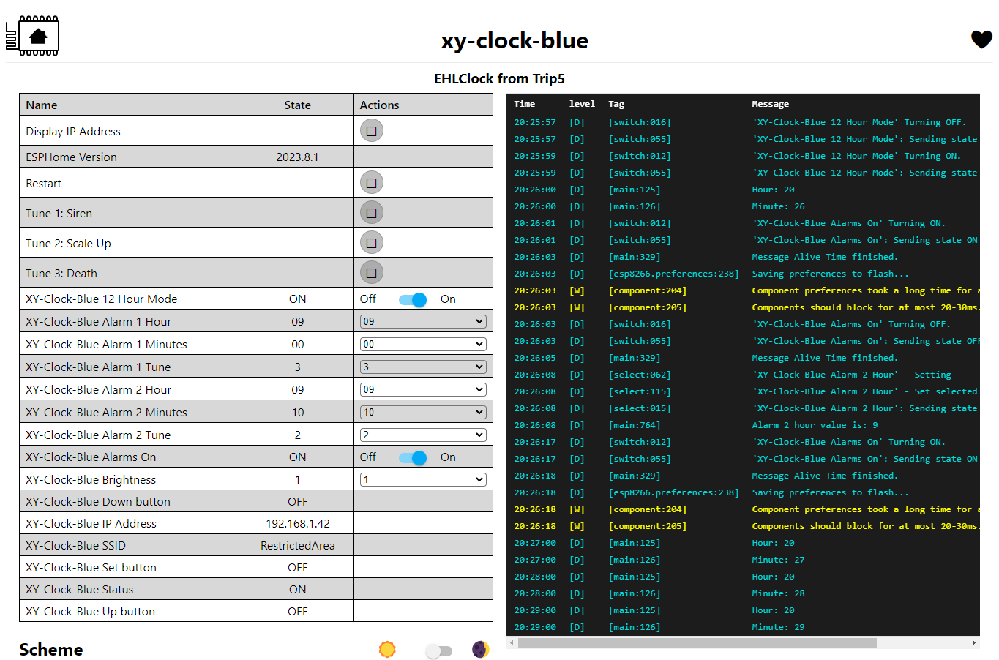

# EspHome-Led-Clock

EHLC is meant to be used on ESP-based LED Clocks using ESPHome. So far, it works with Sinilink Wifi XY-Clocks and 303WifiLC01 Clocks. It can probably be adapted for use with other 7-Segment Display clocks. And, of course, it's ESPHome, so it's only limited by your imagination and skill.

A lot of inspiration is taken from the [`EHMTXv2`](https://github.com/lubeda/EspHoMaTriXv2) project... but with a 7-segment display.

Using either clock requires the TM1650 display to be supported by an external component - at least until ESPHome has native support. The 303WifiLC01 Clock also requires an external component to support its RTC chip. The default config is to use my own forks of other repositories (which I link to below).

For now, the file [`EHLClock.yaml`](EHLClock.yaml) contains the full YAML code, including a lengthy lambda that makes it all work.  At some point, I may turn this into a custom component for ESPHome... but for now, you'll just to have carefully edit the YAML to suit your needs.  Or if you have a 303 clock, you can download [`EHLClock303.yaml`](EHLClock303.yaml) which is a pre-edited version of the main YAML.

## Sinilink XY-Clock

This is the link on Aliexpress I have personally used but I am sure there are others:
https://www.aliexpress.com/item/1005004427096126.html

### Flashing Pins

Don't forget to connect GPIO0 to GND when first connecting to your serial flasher!

## 303WifiLC01 Clock

This is the link on Aliexpress I have personally used but I am sure there are others:
https://www.aliexpress.com/item/1005003163124952.html

### Flashing Pins

Don't forget to connect GPIO0 to GND when first connecting to your serial flasher!

## Using This firmware

This is ESPHome, so it's not pretty but very functional.  You should set your wifi information in the YAML and edit it carefully, especially if not using a Sinilink XY-Clock.
I have included functionality for 2 alarms for now but you can likely increase that number.  You can also edit the tunes available to the clock by editing the RTTTL code
(see below for some useful links).

If using this device on a network outside your usual, ESPHome will, after 30 seconds, give up trying to connect to its "home" network and enter AP mode.
You should then connect to the hotspot (with a mobile phone) and then go to 192.168.4.1 in a browser to select which local wifi network you would like it to connect to.
The clock will display its IP address on boot and also by holding down the set button for more than 1 second. When returning home, you will have to go through this process again.
Be sure if you are using this clock as a travel clock to NOT use Home Assistant as a time source (it doesn't by default anyways).

There does appear to be some errors with "Component preferences took a long time for an operation" but it only happens when saving persistent variables to flash and doesn't seem to affect functionality, unless you try to change a variable during this moment.

### Screenshot

Ideally, this would look a lot prettier than it does but there's not a lot I can with the default ESPHome WebUI.

### Button Functions

By default, the buttons can be used as such:

| Button  | Short-click Function | Long-press Function (hold for 1 second) |
| ------- | -------------------- |----------------------------------------- |
| Up      | Increase brightness  | Toggle alarms on/off (only on XY-Clock) |
| Down    | Decrease brightness | Toggle Time Zone Offset on/off |
| Set     | Toggle 12/24-hour mode | Show the clock's IP address |

Of course, this is ESPHome, so you can change the button functions by editing the YAML.

### Time Zones

It's up to you how to handle time zones. I prefer to keep my home time zone (Korea) as the one I live in and use the offset option according to the time difference of with Korea.
You can set an offset with a number that is a positive or negative value with decimal places (ie. 2, -2, 12.5).

You could also set your time zone to GMT and make the default offset match your home.  I haven't really experimented with this way so your mileage may vary,
especially if you live in an area that uses Daylight Savings Time.

I have allowed steps of 0.25 (equal to 15 minutes) but I notice ESPHome does not enforce those steps. It is possible to set an offset like 0.01 (which would be 36 seconds).
Be careful.

### Date Display

This clock can display the date at configurable intervals.  The display interval checks how long the clock was displayed for and then displays the date for the specified time
(in seconds).  Keep in mind that displaying the message from the Home Assistant integration will not interrupt this count, so I recommend choosing sane and even numbers.

## Integration with Home Assistant

This example will send a message that will display for 3 seconds before reverting to the clock for 5 seconds, and repeat until 20 seconds is finished (if it is displaying the message, it will finish that last 3 seconds). Unfortunately you are limited to what the TM1650 can actually display so you should probably test it out before adding it to an automation. On the Sinilink, decimal places will only work after the 1st or 2nd digit since the colon actually relies on the 3rd and 4th decimal, so it's perfect for displaying weather or room temperatures or even crypto prices. On the 303, the decimal after the 2nd digit is non-functional and is used by the colon instead.

The Sinilink Clock has a piezo speaker, so this service can play a Nokia-style tune through the piezo speaker. I recommend just doing a search for "RTTTL" and the name of the song you would like.  If you really want a lot, check out: https://picaxe.com/rtttl-ringtones-for-tune-command/

## Useful Links

What started my curiousity (a long discussion on ESP-based 7-segment clocks): https://github.com/arendst/Tasmota/discussions/15788

Tasmota Template for the Sinilink XY-Clock: https://templates.blakadder.com/XY-Clock.html

Maarten Penning's fantastic repository regarding the 303WIFILC01: https://github.com/maarten-pennings/303WIFILC01/tree/main

Buzzer13's TM1650 ESPHome component: https://github.com/buzzer13/esphome-components

Trombik's ESPHome Component for the DS1302 RTC (used on the 303): https://github.com/trombik/esphome-component-ds1302

About outputting to the Display: https://esphome.io/components/display/tm1637.html?highlight=tm1637

What characters can be displayed: https://esphome.io/components/display/max7219.html#display-max7219-characters

ESPHome's Display: https://esphome.io/components/display/index.html

About the Rtttl Buzzer: https://esphome.io/components/rtttl.html

