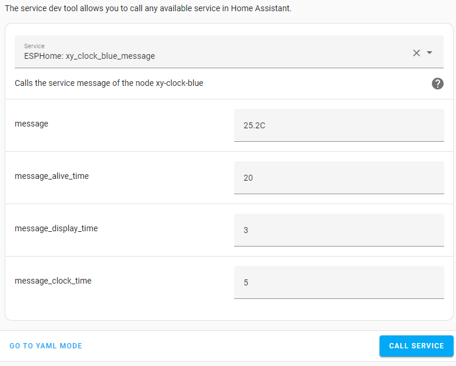
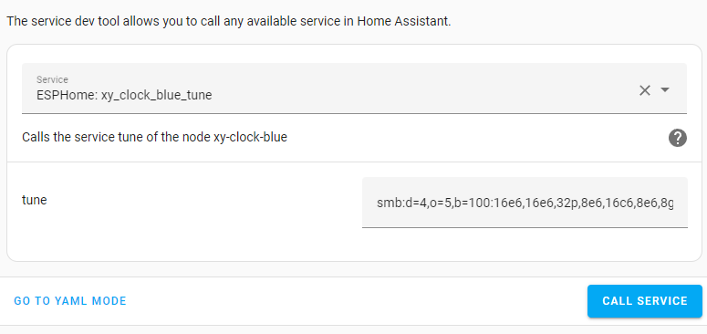

# EspHome-Led-Clock

EHLC is meant to be used on ESP-based LED Clocks using ESPHome. So far, it works with Sinilink Wifi XY-Clocks and 303WifiLC01 Clocks. It can probably be adapted for use with other 7-Segment Display clocks. And, of course, it's ESPHome, so it's only limited by your imagination and skill.

A lot of inspiration is taken from the [EHMTXv2](https://github.com/lubeda/EspHoMaTriXv2) project... but with a 7-segment display.

Using either clock requires the TM1650 display to be supported by external component - at least until ESPHome has native support. The 303WifiLC01 Clock also requires an external component to support its RTC chip. The default config is to use my own forks of other repositories (which I link to below).

For now, the file [`EHLClock.yaml`](EHLClock.yaml) contains the full YAML code, including a lengthy lambda that makes it all work.  At some point, I may turn this into a custom component for ESPHome... but for now, you'll just to have carefully edit the YAML to suit your needs.

## Sinilink XY-Clock

This is the link on Aliexpress I have personally used but I am sure there are others:
https://www.aliexpress.com/item/1005004427096126.html

### Flashing Pins

Don't forget to connect GPIO0 to GND when first connecting to your serial flasher!

## 303WifiLC01 Clock

This is the link on Aliexpress I have personally used but I am sure there are others:
https://www.aliexpress.com/item/1005003163124952.html

### Flashing Pins

Don't forget to connect GPIO0 to GND when first connecting to your serial flasher!

## Integration with Home Assistant

This example will send a message that will display for 3 seconds before reverting to the clock for 5 seconds, and repeat until 20 seconds is finished (if it is displaying the message, it will finish that last 3 seconds). Unfortunately you are limited to what the TM1650 can actually display so you should probably test it out before adding it to an automation. On the Sinilink, decimal places will only work after the 1st or 2nd digit since the colon actually relies on the 3rd and 4th decimal, so it's perfect for displaying weather or room temperatures or even crypto prices. On the 303, the decimal after the 2nd digit is non-functional and is used by the colon instead.

The Sinilink Clock has a piezo speaker, so this service can play a Nokia-style tune through the piezo speaker. I recommend just doing a search for "RTTTL" and the name of the song you would like.  If you really want a lot, check out: https://picaxe.com/rtttl-ringtones-for-tune-command/

## Useful Links

What started my curiousity (a long discussion on ESP-based 7-segment clocks): https://github.com/arendst/Tasmota/discussions/15788

Tasmota Template for the Sinilink XY-Clock: https://templates.blakadder.com/XY-Clock.html

Maarten Penning's fantastic repository regarding the 303WIFILC01: https://github.com/maarten-pennings/303WIFILC01/tree/main

Buzzer13's TM1650 ESPHome component: https://github.com/buzzer13/esphome-components

Trombik's ESPHome Component for the DS1302 RTC (used on the 303): https://github.com/trombik/esphome-component-ds1302

About outputting to the Display: https://esphome.io/components/display/tm1637.html?highlight=tm1637

What characters can be displayed: https://esphome.io/components/display/max7219.html#display-max7219-characters

ESPHome's Display: https://esphome.io/components/display/index.html

About the Rtttl Buzzer: https://esphome.io/components/rtttl.html

