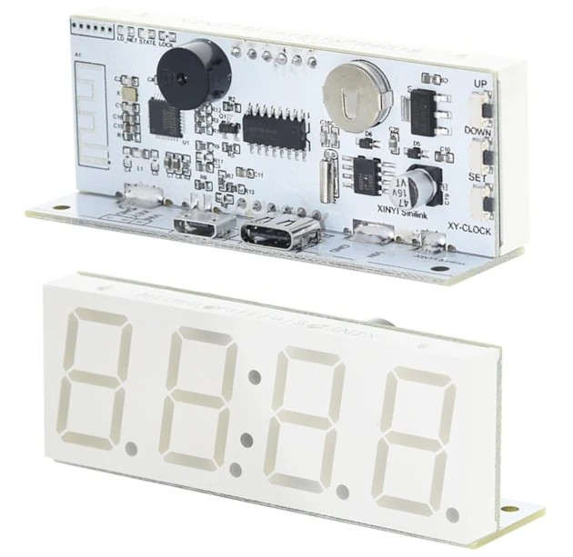
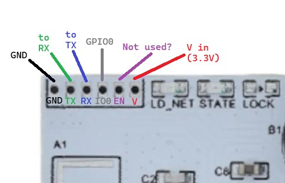
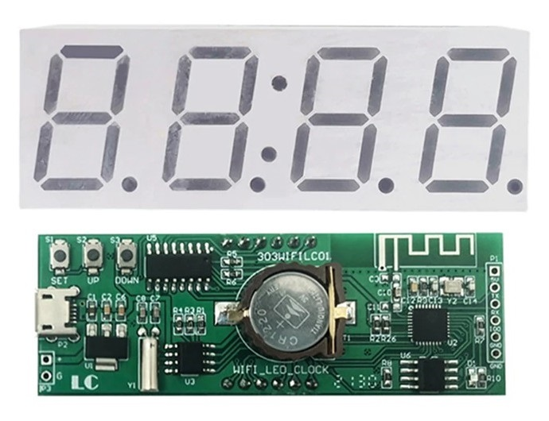
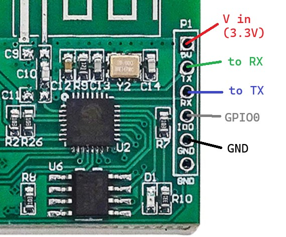
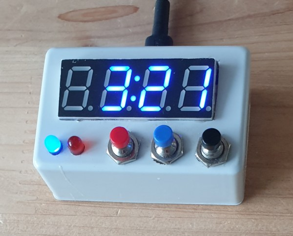
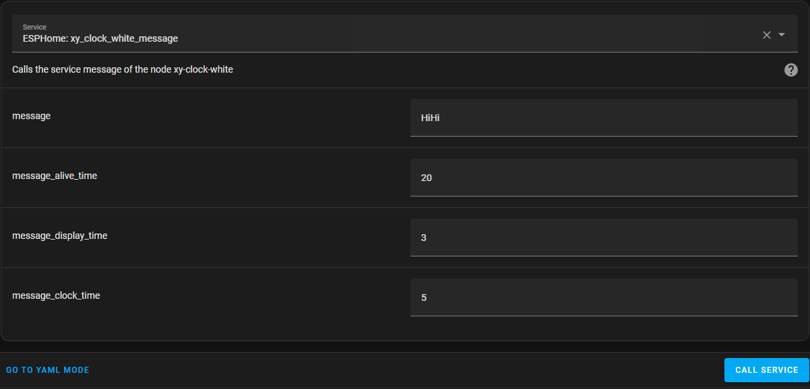
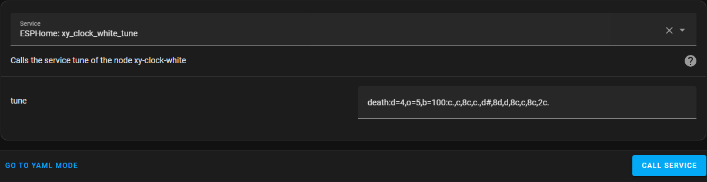

# EspHome-Led-Clock

EHLC is meant to be used on ESP-based LED Clocks using ESPHome. So far, it works with Sinilink Wifi XY-Clocks and 303WifiLC01 Clocks. It can probably be adapted for use with other 7-Segment Display clocks. And, of course, it's ESPHome, so it's only limited by your imagination and skill.

A lot of inspiration is taken from the [`EHMTXv2`](https://github.com/lubeda/EspHoMaTriXv2) project... but with a 7-segment display.

Using either clock requires the TM1650 display to be supported by an external component - at least until ESPHome has native support. The 303WifiLC01 Clock also requires an external component to support its RTC chip. The default config is to use my own forks of other repositories (which I link to below).

Due to memory constraints on the ESP8266 these clocks use, I've decided to split the functions by how you may choose to use the clock.  Read below for more details.

---

## New to ESPHome?

Try following this step-by-step to get Docker onto your computer: [Beginner’s Guide to Installing ESPHome on Docker Desktop](https://deploy-preview-4411--esphome.netlify.app/guides/beginners_guide_docker_desktop)

And this to compile the YAML: [Beginner's Guide to Adding Devices](https://deploy-preview-4411--esphome.netlify.app/guides/beginners_guide_adding_devices)

These guides are proposed for the ESPHome documentation and if you find them helpful, it would be great if you could leave a comment in the [Pull Request](https://github.com/esphome/esphome-docs/pull/4411) to get them added to the ESPHome Docs officially.

### New to Flashing a Device?

Please read this: [Physically Connecting to your Device](https://esphome.io/guides/physical_device_connection).

---

## Sinilink XY-Clock



This is the link on Aliexpress I have personally used but I am sure there are others:
https://www.aliexpress.com/item/1005004427096126.html

### Flashing Pins

Don't forget to connect GPIO0 to GND when first connecting to your serial flasher!



Also, sometimes I've had to plug in the USB cable after making the connections... not sure why.

---

## 303WifiLC01 Clock



This is the link on Aliexpress I have personally used but I am sure there are others:
https://www.aliexpress.com/item/1005003163124952.html

### Flashing Pins

Don't forget to connect GPIO0 to GND when first connecting to your serial flasher!



---

## Handmade TM1637 Clock (with a Lolin ESP32 Lite)



---

## Using This firmware

This is ESPHome, so it's not pretty but very functional.  You should set your wifi information in the YAML and edit it carefully, especially if not using a Sinilink XY-Clock.
I have included functionality for 2 alarms for now but you can likely increase that number.  You can also edit the tunes available to the clock by editing the RTTTL code
(see below for some useful links).

If using this device on a network outside your usual, ESPHome will, after 10 seconds (set by the YAML), give up trying to connect to its "home" network and enter AP mode.
You should then connect to the hotspot (with a mobile phone) and then go to 192.168.4.1 in a browser to select which local wifi network you would like it to connect to.
The clock will display its IP address on boot and also by holding down the set button for more than 1 second. When returning home, you will have to go through this process again.
Be sure if you are using this clock as a travel clock to NOT use Home Assistant as a time source (the non-HA version uses SNTP by default).

There does appear to be some errors with "Component preferences took a long time for an operation" but it only happens when saving persistent variables to flash and doesn't seem to affect functionality, unless you try to change a variable during this moment.

### Date Display

The clock can display the date at configurable intervals.
The display interval checks how long the clock was displayed for and then displays the date for the specified time (in seconds).
Keep in mind that displaying the message from the Home Assistant integration will not interrupt this count, so I recommend choosing sane and even numbers.

### Time Sync

Time can be synced to the Internet at configurable intervals between 1 - 24 hours, provided the wifi network is connected.

### Alarms

The clock can play alarms at configurable intervals. The Sinilink Clock has a piezo speaker, so it can play a Nokia-style tune. The 303 does not (so the file must be edited to remove a lot of lines... there are many notes in the YAML to make this easier).

Please note the default YAML has 2 alarms available and 3 tunes.  See below for more information regarding the speaker and how to play tunes.

### Flip It!

In the yaml files are notes how to flip your display and use it upside-down.  You should use a different `segment_mapping` as well.

Be sure to check that the yaml file has `backward: true`.

---

## Regular Version

The file [`EHLClock.yaml`](EHLClock.yaml) contains functions useful for using the clock as... mostly just a clock but with some power-saving functions.
It includes all of the functions above as well as these below.  This version has a WebUI which can be accessed via it's IP after connecting the clock to Wifi.
So if you need a travel clock, this may be the ideal one for you.  It can still be controlled by Home Assistant as well but is not dependent on it to function.

### Time Zone Offset

It's up to you how to handle time offset.  It will affect the main time zone as well as the alternate time zone
You can set an offset with a number that is a positive or negative value with decimal places (ie. 2, -2, 12.5).

I have allowed steps of 0.25 (equal to 15 minutes) but I notice ESPHome does not enforce those steps. It is possible to set an offset like 0.01 (which would be 36 seconds).
Be careful.

### Wifi Stop Seek

This is disabled by default but by turning it on, the clock will disable its wifi radio after a configurable time if the network connection is dropped.
Note that this does not turn wifi off if connected, it's merely a timeout for when the configured wifi connection cannot be made. 
This is meant as a power-saving feature in the event of a power blackout.

Under normal conditions, when an ESPHome device loses wifi connectivity, it will continuously seek out a wifi connection or activate a hotspot to allow configuring a wifi connection.
While in this non-connected state, the clock will use more power than usual. If you have a coin-cell battery that maintains the RTC during a blackout,
you could re-connect the clock to a powerbank or some other power source and it will continue to function.

Please note that this also means that the clock will not try to connect to wifi again (this will be indicated on the screen as "Wifi Off"),
unless you reset the power, which just means unplugging it and plugging it back in again.

The time to attempt connection is set in the WebUI.  Do not set this time too short for usual circumstances.  The range is 60 to 315 seconds.
Also, do not go outside these numbers as the variable that holds this number is limited to this range.

I have allowed 60 seconds minimum in the options but this could mean your clock stops trying to connect to wifi just because
your router rebooted or the wifi was a bit sketchy. So you should probably set it to something reasonable.
The default is 180 seconds which I think is enough time for even the slowest router to reboot, but it's your choice.
Also keep in mind that this time will affect how long the configuration hotspot is available for.
The hotspot will activate after 10 seconds (lowered from 60 seconds which is ESPHome default).

You can enable or disable this mode by holding the button for 5 seconds to toggle the function. The wifi will be turned on again if it has been turned off.

### Display Off

There are two options to turn off the display. One is to turn off the display after a configurable time when the clock is not being used (in minutes).
The other is to turn off the display when there is no Wifi connection (in seconds).  The display may be turned on again by pressing the button.

### Power Consumption

*Sinilink XY-Clock Blue LED, 2024.11.10 Version, 1 hour each mode, measured with a FNIRSI FNB-58 powered externally*

| Status: Modes                                        | Power usage |
| ---------------------------------------------------- | ----------- |
| Connected: Display On - Brightness 7                 | 147.13 mAh  |
| Connected: Display On - Brightness 1                 | 126.66 mAh  |
| Connected: Display Off after 5 min                   | 122.03 mAh  |
| No Wifi: Stop Seek Off & Display On - Brightness 1   | 128.33 mAh  |
| No Wifi: Stop Seek On & Display On - Brightness 1    | 73.35 mAh   |
| No Wifi: Stop Seek On & Display Off after 30 sec     | 69.77 mAh   |

#### What Does This Mean?

On maximum power savings, you could power the clock from a 5000mAh powerbank for almost 3 days: `5000mAh / 70mA ≈ 71.4 hours`!

### LED Output

While the clock is attempting to connect to wifi or while in hotspot mode, the blue LED will pulse on and off every 1 second.

If Stop Seek is enabled, then the LED will pulse on or off every 2 seconds during connection attempts.

If connected to Wifi or Stop Seek has activated, the LED will turn off completely.

### Button Functions

By default, the buttons can be used as such:

| Button  | Short-click Function | Long-press Function (hold for 1 second) |
| ------- | -------------------- |---------------------------------------- |
| Up      | Increase brightness  | Toggle the Wifi Stop Seek (see below)   |
| Down    | Decrease brightness  | Toggle Time Zone Offset on/off          |
| Set     | Toggle 12/24-hour mode | Show the clock's IP address (or other wifi status) |

Of course, this is ESPHome, so you can change the button functions by editing the YAML if you wish.

### Special Note Regarding the WebUI's Internet Dependence

ESPHome devices usually rely on the Internet to be available to access a Javascript file that formats the web UI.
Specifically, the device will look for https://oi.esphome.io/v2/www.js but this file can be made available on-device with this included in the `webserver:` section.
This is added to the non-HA version by default.

```yaml
  local: true
```

If you don't mind the device's WebUI being dependent on the Internet, you could remove this line.
You could consider hosting the file on another machine in-house, too by using something like:

```yaml
  js_include: ""
  js_url: "http://192.168.1.1/esphome-www/www.js"
```
Please note that for some reason, I'm not sure that the UI can be viewed from an Chrome-based mobile browser. Maybe my phone has an issue.
It seems to work fine when viewing on a computer or an Apple phone. If you have information to share, I'd be glad to know why this is.

---

## Home Assistant Version

The file [`EHLClock-HA.yaml`](EHLClock-HA.yaml) contains functions useful for using the clock with Home Assistant.
It does not include the WebUI, Time Zone Offset, or Wifi Stop Seek but it does include Alarms and all of the functions below.

### Alternate Time Zone

This option is to allow displaying a Time Zone other than your "home" time zone.  It can be activated permanently.

Please note that the time zones MUST be in POSIX format instead of the usual Olsen type (`Asia/Seoul`).

POSIX formats look like: `KST-9` or `PST8PDT,M3.2.0/2:00:00,M11.1.0/2:00:00` or `AST4ADT,M3.2.0,M11.1.0`.

They include daylight savings and time-switches in the formatting. So, there is no reliance on the ESPHome Olsen database to be current.
You can view a lot of the time zones in the world in POSIX format [`here`](https://github.com/nayarsystems/posix_tz_db/blob/master/zones.csv) or
[`here`](https://support.cyberdata.net/portal/en/kb/articles/010d63c0cfce3676151e1f2d5442e311).
If you need to make a custom POSIX format you can look [`here`](https://developer.ibm.com/articles/au-aix-posix/) or even better, use this
[`POSIX Generator`](https://www.topyuan.top/posix) courtesy of TopYuan.

### Service Calls



This example will send a message that will display for 3 seconds before reverting to the clock for 5 seconds, and repeat until 20 seconds is finished (if it is displaying the message, it will finish that last 3 seconds). Unfortunately you are limited to what the TM1650 can actually display so you should probably test it out before adding it to an automation. On the Sinilink, decimal places will only work after the 1st or 2nd digit since the colon actually relies on the 3rd and 4th decimal, so it's perfect for displaying weather or room temperatures or even crypto prices. On the 303, the decimal after the 2nd digit is non-functional and is used by the colon instead.



This service is just for the Sinilink Clock and other clocks with a piezo speaker.  See above and below for more info about RTTTL music.

### Template Sensors

This will allow the clock to display information screens, following a single interval of clock and date screens.  You can display all screens at once or one per interval.
They are all treated as sensors, similarly as my [ESPHome-eInk-Boards](https://github.com/trip5/ESPHome-eInk-Boards) projects.

Put something like this in your `configuration.yaml`:

```yaml
template: !include template.yaml
```

Anything in `configuration.yaml` under the `template:` heading must now be moved to `template.yaml`. Take a quick look [here](https://community.home-assistant.io/t/how-do-i-setup-template-trigger-sensor-in-a-splitting-config/718626/) for some examples on an easy way to format `template.yaml`.

The file [`template.yaml`](template.yaml) contains several examples how to add sensors that can be automatically shown by the clock.
I personally use only one sensor in my Home Assistant and 2 clocks in the house get data from the same sensor but you can (of course) create a sensor for each  individual clock.

### Button Functions

By default, the buttons can be used as such:

| Button  | Short-click Function | Long-press Function (hold for 1 second) |
| ------- | -------------------- |---------------------------------------- |
| Up      | Increase brightness  | Toggle HA Sensors Data All |
| Down    | Decrease brightness | Toggle Alt Time Zone |
| Set     | Toggle 12/24-hour mode | Toggle HA Sensors Data Stop |

Of course, this is ESPHome, so you can change the button functions by editing the YAML if you wish.

---

## Update History

| Date       | Release Notes    |
| ---------- | ---------------- |
| 2025.05.26 | Very minor fix to sensors |
| 2024.12.09 | Recoded to remove many global variables, relying on numbers and switches where possible, hard-coded variables removed, alarms version re-integrated into main version |
| 2024.11.10 | TM1650 driver & YAMLs updated to allow upside-down display, OTA display status works, power measurements complete |
| 2024.10.29 | Added Alarms version, removed alarms from regular version, added Display Off options and hard-coded variables to main and Alarms version |
| 2024.08.22 | Added `local: true` to non-HA version |
| 2024.06.29 | Added Home Assistant version, major changes to main version, fixed time sync error |
| 2023.11.16 | Wifi Stop Seek, improved status messages |
| 2023.10.22 | Show date on intervals |
| 2023.10.04 | Colon blink configurable |
| 2023.08.27 | Time zone offset added |
| 2023.08.26 | Alarms, IP display |
| 2023.08.19 | 303 Clock support added |
| 2023.06.29 | Sinilink XY-Clock: Basic functionality, HA integration |

---

## Useful Links

What started my curiousity (a long discussion on ESP-based 7-segment clocks): https://github.com/arendst/Tasmota/discussions/15788

Tasmota Template for the Sinilink XY-Clock: https://templates.blakadder.com/XY-Clock.html

Maarten Penning's fantastic repository regarding the 303WIFILC01: https://github.com/maarten-pennings/303WIFILC01/tree/main

About outputting to the Display: https://esphome.io/components/display/tm1637.html?highlight=tm1637

ESPHome's Display: https://esphome.io/components/display/index.html

### Speaker Notes

If you plan to build your own and want a speaker, get a passive one like the KY-006.  Active ones are a pain to get working with ESPHome.

About the Rtttl Buzzer: https://esphome.io/components/rtttl.html

Some RTTTL tunes: https://picaxe.com/rtttl-ringtones-for-tune-command/

### TM1650 Display

Buzzer13's TM1650 ESPHome component: https://github.com/buzzer13/esphome-components

My fork (which includes a highly modified font) and backward function: https://github.com/trip5/esphome-tm1650

### DS1302 RTC

Trombik's ESPHome Component for the DS1302 RTC (used on the 303): https://github.com/trombik/esphome-component-ds1302

My fork (probably the same): https://github.com/trip5/esphome-ds1302

### My Other Clocks

EspHome-Led-PixelClock: https://github.com/trip5/EspHome-Led-PixelClock

EspHome-VFD-Clock: https://github.com/trip5/EspHome-VFD-PixelClock
