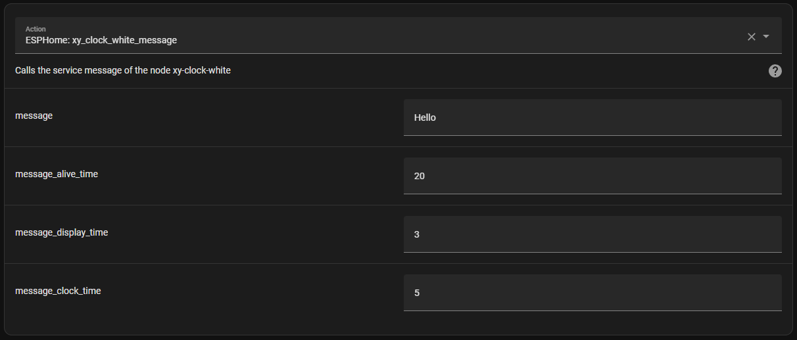
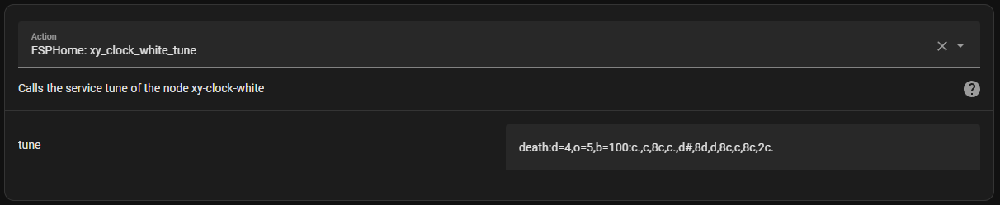

# EspHome-Led-Clock

EHLC is meant to be used on ESP-based LED Clocks using ESPHome. So far, it works with Sinilink Wifi XY-Clocks and 303WifiLC01 Clocks. It can probably be adapted for use with other 7-Segment Display clocks. And, of course, it's ESPHome, so it's only limited by your imagination and skill.

A lot of inspiration is taken from the [`EHMTXv2`](https://github.com/lubeda/EspHoMaTriXv2) project... but with a 7-segment display.

Using either clock requires the TM1650 display to be supported by an external component - at least until ESPHome has native support. The 303WifiLC01 Clock also requires an external component to support its RTC chip. The default config is to use my own forks of other repositories (which I link to below).

For now, the file [`EHLClock.yaml`](EHLClock.yaml) contains the full YAML code, including a lengthy lambda that makes it all work.  At some point, I may turn this into a custom component for ESPHome... but for now, you'll just to have carefully edit the YAML to suit your needs.  Or if you have a 303 clock, you can download [`EHLClock303.yaml`](EHLClock303.yaml) which is a pre-edited version of the main YAML.

#### Note: ESPHome must be version 2023.12.0 or higher!

## Sinilink XY-Clock

This is the link on Aliexpress I have personally used but I am sure there are others:
https://www.aliexpress.com/item/1005004427096126.html

### Flashing Pins

Don't forget to connect GPIO0 to GND when first connecting to your serial flasher!

## 303WifiLC01 Clock

This is the link on Aliexpress I have personally used but I am sure there are others:
https://www.aliexpress.com/item/1005003163124952.html

### Flashing Pins

Don't forget to connect GPIO0 to GND when first connecting to your serial flasher!

## Using This firmware

This is ESPHome, so it's not pretty but very functional.  You should set your wifi information in the YAML and edit it carefully, especially if not using a Sinilink XY-Clock.
I have included functionality for 2 alarms for now but you can likely increase that number.  You can also edit the tunes available to the clock by editing the RTTTL code
(see below for some useful links).

If using this device on a network outside your usual, ESPHome will, after 10 seconds (set by the YAML), give up trying to connect to its "home" network and enter AP mode.
You should then connect to the hotspot (with a mobile phone) and then go to 192.168.4.1 in a browser to select which local wifi network you would like it to connect to.
The clock will display its IP address on boot and also by holding down the set button for more than 1 second. When returning home, you will have to go through this process again.
Be sure if you are using this clock as a travel clock to NOT use Home Assistant as a time source (it doesn't by default anyways).

There does appear to be some errors with "Component preferences took a long time for an operation" but it only happens when saving persistent variables to flash and doesn't seem to affect functionality, unless you try to change a variable during this moment.

### Screenshot

Ideally, this would look a lot prettier than it does but there's not a lot I can with the default ESPHome WebUI.  The alarms take up a lot.

### Button Functions

By default, the buttons can be used as such:

| Button  | Short-click Function | Long-press Function (hold for 1 second) | Very Long-press Function (hold 5s) |
| ------- | -------------------- |---------------------------------------- | --------------------------------------------- |
| Up      | Increase brightness  | Toggle all alarms on/off (only on XY-Clock) | |
| Down    | Decrease brightness | Toggle Time Zone Offset on/off | |
| Set     | Toggle 12/24-hour mode | Show the clock's IP address (or other wifi status) | Toggle the Wifi Stop Seek (see below) |

Of course, this is ESPHome, so you can change the button functions by editing the YAML if you wish.

### Date Display

The clock can display the date at configurable intervals.
The display interval checks how long the clock was displayed for and then displays the date for the specified time (in seconds).
Keep in mind that displaying the message from the Home Assistant integration will not interrupt this count, so I recommend choosing sane and even numbers.

### Time Sync

Time can be synced to the Internet at configurable intervals between 1 - 24 hours, provided the wifi network is connected.

### Time Zones

It's up to you how to handle time zones. I prefer to keep my home time zone (Korea) as the one I live in and use the offset option according to the time difference of with Korea.
You can set an offset with a number that is a positive or negative value with decimal places (ie. 2, -2, 12.5).

You could also set your time zone to GMT and make the default offset match your home.  I haven't really experimented with this way so your mileage may vary,
especially if you live in an area that uses Daylight Savings Time.

I have allowed steps of 0.25 (equal to 15 minutes) but I notice ESPHome does not enforce those steps. It is possible to set an offset like 0.01 (which would be 36 seconds).
Be careful.

### Wifi Stop Seek

This is disabled by default but by turning it on, the clock will disable its wifi radio after a configurable time if the network connection is dropped.
Note that this does not turn wifi off if connected, it's merely a timeout for when the configured wifi connection cannot be made. 
This is meant as a power-saving feature in the event of a power blackout.

Under normal conditions, when an ESPHome device loses wifi connectivity, it will continuously seek out a wifi connection or activate a hotspot to allow configuring a wifi connection.
While in this non-connected state, the clock will use more power than usual. If you have a coin-cell battery that maintains the RTC during a blackout,
you could re-connect the clock to a powerbank or some other power source and it will continue to function.

Please note that this also means that the clock will not try to connect to wifi again (this will be indicated on the screen as "Wifi Off" when long-pressing the button),
unless you reset the power, which just means unplugging it and plugging it back in again.

Do not set this time too short.  I have allowed 60 seconds minimum in the options but this could mean your clock stops trying to connect to wifi just because
your router rebooted or the wifi was a bit sketchy. The default is 120 seconds which I think is enough time for even the slowest router to reboot, but it's your choice.
Also keep in mind that this time will affect how long the configuration hotspot is available for.
The hotspot will activate after 10 seconds (lowered from 60 seconds which is ESPHome default).

You can enable or disable this mode by holding the button for 5 seconds to toggle the function. The wifi will be turned on again if it has been turned off.

#### Power Consumption (measured with XY-Clock Blue, 2023.11.16 Version)

| Status / Mode           | Power usage (24 hours) |
| ----------------------- | ---------------------- |
| Connected               | 2500 mAh               |
| Stop Seek Off & No Wifi | 2800 mAh               |
| Stop Seek On & Wifi Off | 750 mAh                |

### LED Output

While the clock is connecting to wifi or while in hotspot mode, the blue LED will pulse on and off. In regular mode, the LED will turn on or off will be every 1 second.
If Stop Seek is enabled, the led will pulse on or off every 2 seconds. If connected to Wifi or Stop Seek (as above) is active, the LED will turn off completely.

## Integration with Home Assistant

This example will send a message that will display for 3 seconds before reverting to the clock for 5 seconds, and repeat until 20 seconds is finished (if it is displaying the message, it will finish that last 3 seconds). Unfortunately you are limited to what the TM1650 can actually display so you should probably test it out before adding it to an automation. On the Sinilink, decimal places will only work after the 1st or 2nd digit since the colon actually relies on the 3rd and 4th decimal, so it's perfect for displaying weather or room temperatures or even crypto prices. On the 303, the decimal after the 2nd digit is non-functional and is used by the colon instead.

The Sinilink Clock has a piezo speaker, so this service can play a Nokia-style tune through the piezo speaker. I recommend just doing a search for "RTTTL" and the name of the song you would like.  If you really want a lot, check out: https://picaxe.com/rtttl-ringtones-for-tune-command/

## Update History

| Date       | Release Notes    |
| ---------- | ---------------- |
| 2023.11.16 | Wifi Stop Seek, improved status messages |
| 2023.10.22 | Show date on intervals |
| 2023.10.04 | Colon blink configurable |
| 2023.08.27 | Time zone offset added |
| 2023.08.26 | Alarms, IP display |
| 2023.08.19 | 303 Clock support added |
| 2023.06.29 | Sinilink XY-Clock: Basic functionality, HA integration |

## Useful Links

What started my curiousity (a long discussion on ESP-based 7-segment clocks): https://github.com/arendst/Tasmota/discussions/15788

Tasmota Template for the Sinilink XY-Clock: https://templates.blakadder.com/XY-Clock.html

Maarten Penning's fantastic repository regarding the 303WIFILC01: https://github.com/maarten-pennings/303WIFILC01/tree/main

Buzzer13's TM1650 ESPHome component: https://github.com/buzzer13/esphome-components

Trombik's ESPHome Component for the DS1302 RTC (used on the 303): https://github.com/trombik/esphome-component-ds1302

About outputting to the Display: https://esphome.io/components/display/tm1637.html?highlight=tm1637

What characters can be displayed: https://esphome.io/components/display/max7219.html#display-max7219-characters

ESPHome's Display: https://esphome.io/components/display/index.html

About the Rtttl Buzzer: https://esphome.io/components/rtttl.html

